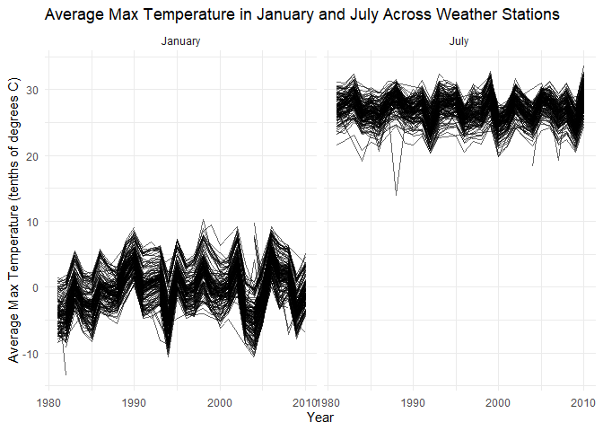
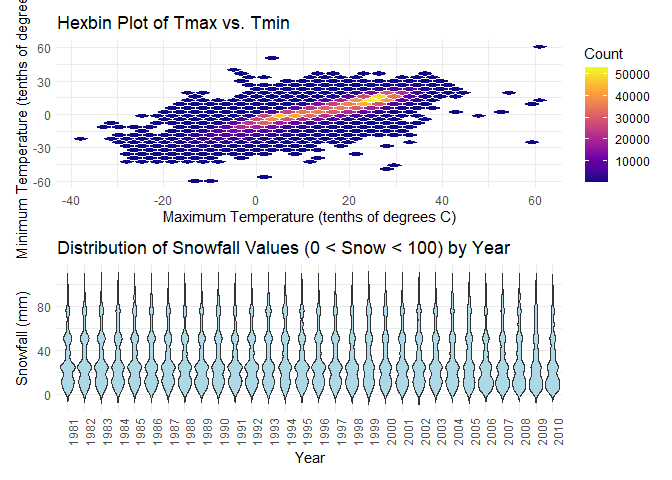
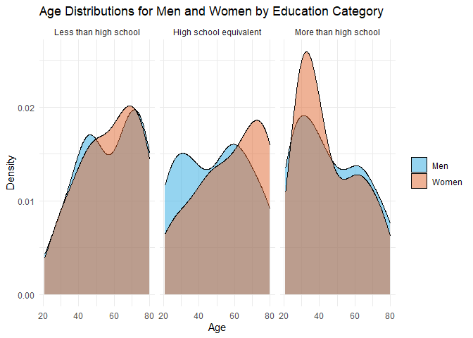
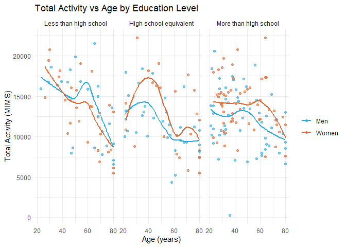
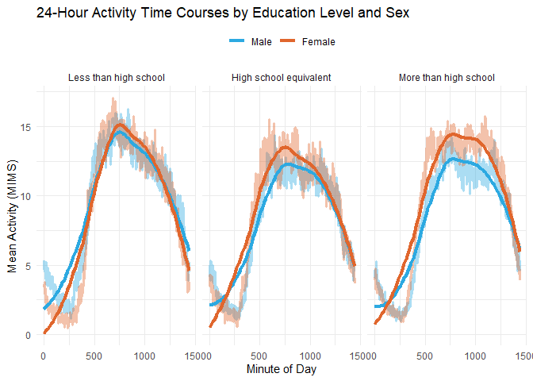
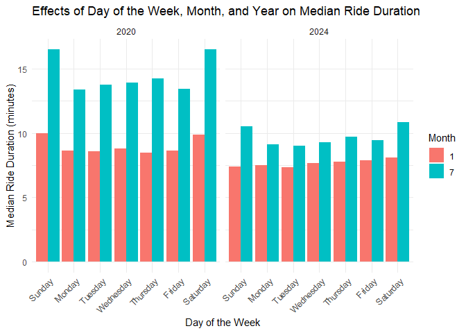
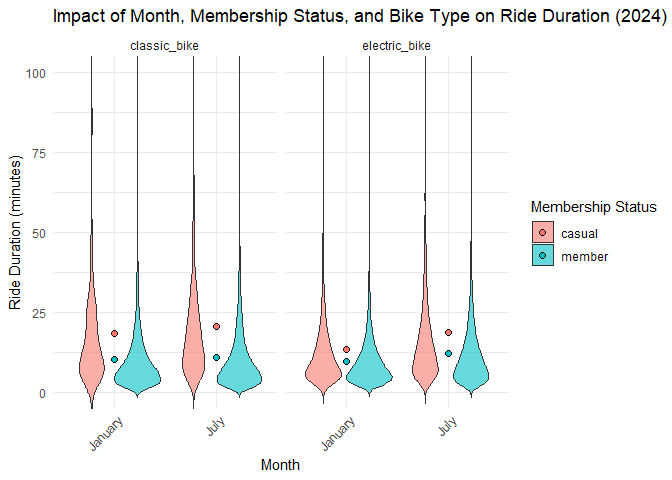
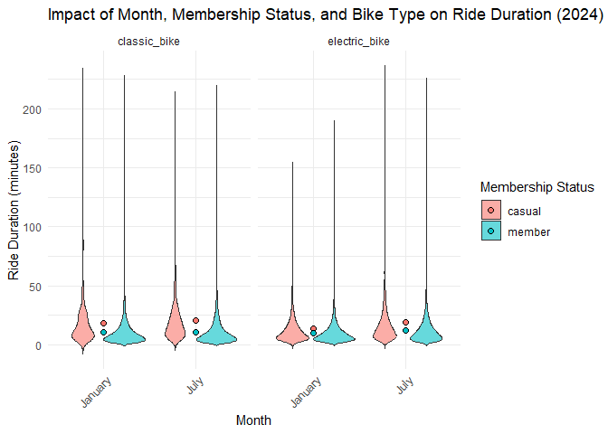

p8105_hw3_xx2485
================
Xiaoni Xu
2024-10-14

Loading needed packages:

``` r
library(p8105.datasets)
library(tidyverse)
library(dplyr)
library(ggplot2)
library(patchwork)
library(viridis)
library(janitor)
```

## Problem 1

Loading the NY NOAA data

``` r
data("ny_noaa") 

noaa_data <- ny_noaa
```

Get the structure and size of the dataset

``` r
noaa_size <- dim(noaa_data)
noaa_structure <- str(noaa_data)
```

    ## tibble [2,595,176 × 7] (S3: tbl_df/tbl/data.frame)
    ##  $ id  : chr [1:2595176] "US1NYAB0001" "US1NYAB0001" "US1NYAB0001" "US1NYAB0001" ...
    ##  $ date: Date[1:2595176], format: "2007-11-01" "2007-11-02" ...
    ##  $ prcp: int [1:2595176] NA NA NA NA NA NA NA NA NA NA ...
    ##  $ snow: int [1:2595176] NA NA NA NA NA NA NA NA NA NA ...
    ##  $ snwd: int [1:2595176] NA NA NA NA NA NA NA NA NA NA ...
    ##  $ tmax: chr [1:2595176] NA NA NA NA ...
    ##  $ tmin: chr [1:2595176] NA NA NA NA ...
    ##  - attr(*, "spec")=
    ##   .. cols(
    ##   ..   id = col_character(),
    ##   ..   date = col_date(format = ""),
    ##   ..   prcp = col_integer(),
    ##   ..   snow = col_integer(),
    ##   ..   snwd = col_integer(),
    ##   ..   tmax = col_character(),
    ##   ..   tmin = col_character()
    ##   .. )

Summarize key variables

``` r
key_variables_summary <- noaa_data %>%
  summarise(
    num_unique_ids = n_distinct(id),
    date_range = range(date, na.rm = TRUE),
    total_rows = n(),
    prcp_missing = sum(is.na(prcp)),
    snow_missing = sum(is.na(snow)),
    snwd_missing = sum(is.na(snwd)),
    tmax_missing = sum(is.na(tmax)),
    tmin_missing = sum(is.na(tmin))
  )
```

    ## Warning: Returning more (or less) than 1 row per `summarise()` group was deprecated in
    ## dplyr 1.1.0.
    ## ℹ Please use `reframe()` instead.
    ## ℹ When switching from `summarise()` to `reframe()`, remember that `reframe()`
    ##   always returns an ungrouped data frame and adjust accordingly.
    ## Call `lifecycle::last_lifecycle_warnings()` to see where this warning was
    ## generated.

The dataset `noaa_data` consists of 2595176 rows and 7 columns. It is
structured as a tibble.

The columns are as follows:

- id: A character vector representing the unique identifier for weather
  stations (e.g., “US1NYAB0001”).

- date: A date column indicating the specific date for each observation,
  spanning from 1981-01-01 to 2010-12-31.

- prcp: An integer column representing the amount of precipitation
  recorded in tenths of mm ranging from 0 to 22860, with an average of
  29.8232355 , with 145838 missing values.

- snow: An integer column indicating the amount of snow recorded in mm
  with an average of 4.987025 and a maximum of 10160, with 381221
  missing values.

- snwd: An integer column for snow depth in mm ranging from 0 to 9195,
  which has 591786 missing values.

- tmax: A character column for the maximum temperature in tenths of
  degrees C, with 1134358 missing values.

- tmin: A character column for the minimum temperature in tenths of
  degrees C, which has 1134420 missing values.

Data cleaning

``` r
# Convert necessary columns to numeric
noaa_data <- noaa_data %>%
  mutate(
    prcp = as.numeric(prcp),
    snow = as.numeric(snow),
    snwd = as.numeric(snwd),
    tmax = as.numeric(tmax),
    tmin = as.numeric(tmin)
  )

# Create separate variables for year, month, and day
noaa_data_cleaned <- noaa_data %>%
  mutate(
    year = year(date),
    month = month(date),
    day = day(date),
    
    # Convert units
    prcp = prcp / 10,  # Convert precipitation from tenths of mm to mm
    snow = snow,       # Snowfall is already in mm
    snwd = snwd,       # Snow depth is already in mm
    tmax = tmax / 10,  # Convert max temperature from tenths of degrees C to degrees C
    tmin = tmin / 10   # Convert min temperature from tenths of degrees C to degrees C
  )

# Analyze snowfall data
# Calculate the most commonly observed snowfall values
snowfall_summary <- noaa_data_cleaned %>%
  filter(!is.na(snow)) %>%  # Remove NA values analysis
  count(snow) %>%
  arrange(desc(n))  # Sort by frequency

# Display the most commonly observed snowfall values
most_common_snowfall <- head(snowfall_summary, 10)  # Get the top 10 values

# Print results
print(most_common_snowfall)
```

    ## # A tibble: 10 × 2
    ##     snow       n
    ##    <dbl>   <int>
    ##  1     0 2008508
    ##  2    25   31022
    ##  3    13   23095
    ##  4    51   18274
    ##  5    76   10173
    ##  6     8    9962
    ##  7     5    9748
    ##  8    38    9197
    ##  9     3    8790
    ## 10   102    6552

Description of the Most Commonly Observed Snowfall Values

The analysis of the snowfall data reveals the following most commonly
observed values:

1.  **`0 mm`**: This is the most frequently recorded snowfall value,
    with **2.008508^{6}** occurrences.

2.  **`25 mm`**: The second most common value, with **3.1022^{4}**
    occurrences.

3.  **`13 mm`**: Observed **2.3095^{4}** times.

4.  **`51 mm`**: This value appears **1.8274^{4}** times.

5.  **`76 mm`**: Recorded **1.0173^{4}** times.

6.  **`8 mm`**: This value has **9962** occurrences.

7.  **`5 mm`**: Recorded **9748** times.

The predominance of 0 mm snowfall days indicates that a significant
portion of the dataset comprises observations from periods without
snowfall. This pattern is typical in many climates including New York,
where snow is not a regular occurrence during the entire year.

Make a two-panel plot showing the average max temperature in January and
in July in each station across years

``` r
# Calculate average max temperature for January and July

avg_temp <- noaa_data_cleaned %>%
  mutate(month = month(date)) %>%
  filter(month %in% c(1, 7)) %>%  
  group_by(id, month, year) %>%  # Group by station ID, month, and year
  summarise(avg_tmax = mean(tmax, na.rm = TRUE)) %>%  # Calculate average max temperature
  ungroup()
```

    ## `summarise()` has grouped output by 'id', 'month'. You can override using the
    ## `.groups` argument.

``` r
# Create two-panel plot
ggplot(avg_temp, aes(x = year, y = avg_tmax)) +
  geom_line(aes(group = id), alpha = 0.6) +  # Line for each station without color mapping
  facet_wrap(~ month, scales = "fixed", labeller = labeller(month = c("1" = "January", "7" = "July"))) +
  labs(title = "Average Max Temperature in January and July Across Weather Stations",
       x = "Year",
       y = "Average Max Temperature (tenths of degrees C)") +
  theme_minimal() +
  theme(legend.position = "none")  # Remove legend
```

    ## Warning: Removed 5640 rows containing missing values or values outside the scale range
    ## (`geom_line()`).

<!-- --> For
the strucure of the plots, there a clear distinction in average maximum
temperatures between January and July. January temperatures are usually
lower, while July temperatures are higher, reflecting seasonal
variations. There is no significance trends in both months over the
years whether showing general decrease or increase in temperature.

Visually, in January, there is a data point in around 1982 that showed
significantly lower temperatures (-17 C approximately), and in July,
there are a few points in 1987, 2004, and 2007 that showed significantly
lower teamperatures (below 20 C). Here are the codes to find all
outliers in the dataset (both too high or too low) from
`print(outliers_summary)`:

Finding outliers

``` r
# Function to identify outliers
identify_outliers <- function(data) {
  Q1 <- quantile(data$avg_tmax, 0.25, na.rm = TRUE)
  Q3 <- quantile(data$avg_tmax, 0.75, na.rm = TRUE)
  IQR <- Q3 - Q1
  
  lower_bound <- Q1 - 1.5 * IQR
  upper_bound <- Q3 + 1.5 * IQR
  
  outliers <- data %>%
    filter(avg_tmax < lower_bound | avg_tmax > upper_bound) %>%
    select(id, year, month, avg_tmax)
  
  return(outliers)
}

# Apply the function to identify outliers for each month
january_outliers <- avg_temp %>%
  filter(month == 1) %>%
  identify_outliers()

july_outliers <- avg_temp %>%
  filter(month == 7) %>%
  identify_outliers()

# Combine results for better visibility
outliers_summary <- bind_rows(
  january_outliers %>% mutate(month = "January"),
  july_outliers %>% mutate(month = "July")
)

# Print the outliers
print(outliers_summary)
```

    ## # A tibble: 45 × 4
    ##    id           year month   avg_tmax
    ##    <chr>       <dbl> <chr>      <dbl>
    ##  1 USC00301723  1982 January   -13.4 
    ##  2 USC00303464  1998 January    10.2 
    ##  3 USC00304996  1994 January   -10.6 
    ##  4 USC00305925  2005 January   -12.2 
    ##  5 USC00306957  2004 January   -10.8 
    ##  6 USC00307633  1999 January     9.49
    ##  7 USR0000NSTO  2004 January     9.75
    ##  8 USW00094725  1994 January   -10.2 
    ##  9 USW00094725  2004 January   -10.4 
    ## 10 USW00094740  2004 January   -10.4 
    ## # ℹ 35 more rows

Make a two-panel plot showing (i) tmax vs tmin for the full dataset; and
(ii) make a plot showing the distribution of snowfall values greater
than 0 and less than 100 separately by year

``` r
# Create a hexbin plot for tmax vs. tmin
tmax_tmin_plot <- ggplot(noaa_data_cleaned, aes(x = tmax, y = tmin)) +
  geom_hex(aes(fill = ..count..), color = "white") +  # Use hexagonal bins and fill based on count
  scale_fill_viridis_c(option = "C") +  # Apply Viridis color scale for counts
  labs(title = "Hexbin Plot of Tmax vs. Tmin",
       x = "Maximum Temperature (tenths of degrees C)",
       y = "Minimum Temperature (tenths of degrees C)",
       fill = "Count") +
  theme_minimal() +
  theme(legend.position = "right")

# Filter and prepare data for snowfall distribution
snowfall_distribution <- noaa_data_cleaned %>%
  filter(snow > 0 & snow < 100) %>%  # Filter for snowfall between 0 and 100
  mutate(year = year(date)) 

# Create a violin plot for snowfall distribution by year
snowfall_plot <- ggplot(snowfall_distribution, aes(x = factor(year), y = snow)) +
  geom_violin(trim = FALSE, fill = "lightblue") +  # Use violin plot
  labs(title = "Distribution of Snowfall Values (0 < Snow < 100) by Year",
       x = "Year",
       y = "Snowfall (mm)") +
  theme_minimal() +
  theme(axis.text.x = element_text(angle = 90, hjust = 1))  # Rotate x-axis text for better readability

# Combine the plots into one two-panel plot using patchwork
combined_plot <- tmax_tmin_plot / snowfall_plot


ggsave("combined_plot.png", plot = combined_plot, width = 6, height = 12)  # Adjust width and height as needed
```

    ## Warning: The dot-dot notation (`..count..`) was deprecated in ggplot2 3.4.0.
    ## ℹ Please use `after_stat(count)` instead.
    ## This warning is displayed once every 8 hours.
    ## Call `lifecycle::last_lifecycle_warnings()` to see where this warning was
    ## generated.

    ## Warning: Removed 1136276 rows containing non-finite outside the scale range
    ## (`stat_binhex()`).

``` r
combined_plot
```

    ## Warning: Removed 1136276 rows containing non-finite outside the scale range
    ## (`stat_binhex()`).

<!-- -->

## Problem 2

Load, tidy, and merge the datasets

``` r
covar_data <- read_csv("data/nhanes_covar.csv", skip = 4) %>%
  clean_names() 
accel_data <- read_csv("data/nhanes_accel.csv") %>%
  clean_names()
```

``` r
# exclude participants less than 21 years of age and missing demographic data
cleaned_covar_data <- covar_data %>%
  filter(age >= 21) %>%  # Assuming 'age' is a variable in covar_data
  drop_na()              # Remove rows with any missing demographic data

# merge datasets
merged_data <- cleaned_covar_data %>%
  inner_join(accel_data, by = "seqn")  # Change 'seqn' to the actual identifier


# encode data with reasonable variable classes
merged_data <- merged_data %>%
  mutate(sex = factor(sex, levels = c(1, 2), labels = c("Male", "Female")),  
         education = factor(education, 
                            levels = c(1, 2, 3), 
                            labels = c("Less than high school", "High school equivalent", "More than high school"),  # Adjusting for education
                            ordered = TRUE)
  )
```

Produce a reader-friendly table for the number of men and women in each
education category

``` r
education_summary <- merged_data %>%
  group_by(education, sex) %>%
  summarize(count = n(), .groups = 'drop') %>%
  pivot_wider(names_from = sex, values_from = count, values_fill = 0)

# Print the summary table
print(education_summary)
```

    ## # A tibble: 3 × 3
    ##   education               Male Female
    ##   <ord>                  <int>  <int>
    ## 1 Less than high school     27     28
    ## 2 High school equivalent    35     23
    ## 3 More than high school     56     59

For less than high school, there is a relatively balanced representation
of genders in this educational category, with slightly more females than
males.

For high school equivalent, there is a notable difference, with more
males (35) compared to females (23). This suggests that males are more
likely to have attained at least a high school diploma compared to
females in this dataset.

For more than high school, females (59) outnumber males (56). This shift
might indicate that women in this dataset have a slightly higher
tendency to pursue education beyond high school, which could reflect
broader trends in educational attainment favoring women in recent years.

Overall, the data shows variation in educational attainment between
males and females across the different categories. While the gender
distribution is relatively balanced in the “Less than high school”
category, males dominate the “High school equivalent” category, while
females lead in the “More than high school” category.

The trends observed in this dataset may reflect societal changes in
educational attainment over time, where females are increasingly
achieving higher education levels compared to males.

Create a visualization of the age distributions for men and women in
each education category

``` r
age_distribution_plot <- ggplot(merged_data, aes(x = age, fill = sex)) +
  geom_density(alpha = 0.5) +  # Use density plots for age distributions
  facet_wrap(~ education) +     # Create separate plots for each education category
  labs(title = "Age Distributions for Men and Women by Education Category",
       x = "Age",
       y = "Density") +
  scale_fill_manual(values = c("#2ca9e1", "#e0662d"), labels = c("Men", "Women")) +
  theme_minimal() +
  theme(legend.title = element_blank())  # Remove legend title

# Print the age distribution plot
print(age_distribution_plot)
```

<!-- -->

For ‘less than high school’, there is no significant difference in age
between men and women, but there is a difference in ‘high school
equivalent’, with a lot more men compared to women at a younger age
(20-30) while women outnumber men at the ages after 65. For ‘more than
high school’, there is a significant difference at age 20-30 with a lot
more women than men.

Aggregate across minutes to create a total activity variable for each
participant

``` r
total_activity <- merged_data %>%
  rowwise() %>%
  mutate(total_activity = sum(c_across(starts_with("min")), na.rm = TRUE))
```

Plot these total activities (y-axis) against age (x-axis)

``` r
activity_plot <- ggplot(total_activity, aes(x = age, y = total_activity, color = sex)) +
  geom_point(alpha = 0.6) +  
  geom_smooth(method = "loess", se = FALSE) + 
  facet_wrap(~ education, nrow = 1) + 
  labs(title = "Total Activity vs Age by Education Level",
       x = "Age (years)",
       y = "Total Activity (MIMS)") +
  scale_color_manual(values = c("#2ca9e1", "#e0662d"), labels = c("Men", "Women")) +
  theme_minimal() +
  theme(legend.title = element_blank())  # Remove legend title

# Print the activity plot
print(activity_plot)
```

    ## `geom_smooth()` using formula = 'y ~ x'

<!-- -->

The plot presents the relationship between total activity and age,
divided across threepanels by education level: “Less than high school”,
“High school equivalent”, and “Morethan high school”. In general, total
activity decreases with age. For less than high school, the women has
higher activity until at around 40 years old. For high school
equivalent, women in general has higher total activity. For more than
high school, women also has higher total activity than men. Higher
education levels suggest a higher and steadier trend in activity across
ages.

Make a three-panel plot that shows the 24-hour activity time courses for
each education level and use color to indicate sex.

``` r
# Reshape the data to long format for activity time course
activity_time_course <- merged_data %>%
  select(seqn, education, sex, starts_with("min")) %>%  
  pivot_longer(cols = starts_with("min"),               # Reshape from wide to long format
               names_to = "minute",
               values_to = "activity") %>%
  mutate(minute = as.numeric(gsub("min", "", minute)))  # Convert minute names to numeric

# Create the plot for 24-hour activity time courses
activity_plot <- ggplot(activity_time_course, aes(x = minute, y = activity, color = sex)) +
  geom_line(stat = "summary", fun = "mean", aes(group = sex), alpha = 0.4, size = 1.2) +  # Plot mean activity over time
  geom_smooth(method = "loess", se = FALSE, linetype = "solid", size = 1.5) +
  facet_wrap(~ education, nrow = 1) +  # Separate panels for each education level
  scale_color_manual(values = c("#2ca9e1", "#e0662d"), labels = c("Male", "Female")) +  # Custom colors
  labs(title = "24-Hour Activity Time Courses by Education Level and Sex",
       x = "Minute of Day",
       y = "Mean Activity (MIMS)") +
  theme_minimal() +
  theme(legend.title = element_blank(),  # Remove legend title
        legend.position = "top")  # Position legend at the top
```

    ## Warning: Using `size` aesthetic for lines was deprecated in ggplot2 3.4.0.
    ## ℹ Please use `linewidth` instead.
    ## This warning is displayed once every 8 hours.
    ## Call `lifecycle::last_lifecycle_warnings()` to see where this warning was
    ## generated.

``` r
print(activity_plot)
```

    ## `geom_smooth()` using formula = 'y ~ x'

<!-- -->

The plot shows the average activity levels of participants throughout
the day, separated by three education levels and sex.

- Less than high school: Men and women have similar activity patterns of
  increasing from 250 to 750 minutes (morning) and lowers steadily after
  750 minutes (noon). The activity is lowest after 1200 minutes (night).

- High school equivalent: Women overall have higher activity levels than
  men, with the general pattern similar to that of the ‘less than high
  school’ group. Men show significantly lower activity level compared to
  the less than high school education group.

- More than high school: Women overall have even higher activity levels
  than men, with the general pattern similar to that of the ‘less than
  high school’ group. Women in this group also has longer period of time
  of higher activity levels.

Individuals with higher education lower but more consistent activity
throughout the day, and higher educated women tend to have higher
activity than men.

## Problem 3

Load, tidy, and merge the datasets

``` r
# import the datasets
jan_2020 <- read_csv("data/Jan 2020 Citi.csv") %>% clean_names() %>% mutate(year = 2020, month = 1)
jan_2024 <- read_csv("data/Jan 2024 Citi.csv") %>% clean_names() %>% mutate(year = 2024, month = 1)
july_2020 <- read_csv("data/July 2020 Citi.csv") %>% clean_names() %>% mutate(year = 2020, month = 7)
july_2024 <- read_csv("data/July 2024 Citi.csv") %>% clean_names() %>% mutate(year = 2024, month = 7)
```

``` r
# combine the datasets
citi_data <- bind_rows(jan_2020, jan_2024, july_2020, july_2024)

# clean and tidy the data
citi_cleaned <- citi_data %>%
  # Convert columns to appropriate types
  mutate(
    rideable_type = factor(rideable_type, levels = c("classic_bike", "electric_bike")),
    weekdays = factor(weekdays, levels = c("Sunday", "Monday", "Tuesday", "Wednesday", "Thursday", "Friday", "Saturday")),
    member_casual = factor(member_casual, levels = c("casual", "member"))
  ) %>%
  # Drop any rows with missing values if necessary
  drop_na()

summary(citi_cleaned)
```

    ##    ride_id                rideable_type        weekdays        duration      
    ##  Length:99253       classic_bike :55483   Sunday   :11455   Min.   :  1.002  
    ##  Class :character   electric_bike:43770   Monday   :14466   1st Qu.:  5.587  
    ##  Mode  :character                         Tuesday  :15497   Median :  9.823  
    ##                                           Wednesday:16848   Mean   : 13.836  
    ##                                           Thursday :14992   3rd Qu.: 17.515  
    ##                                           Friday   :13590   Max.   :238.780  
    ##                                           Saturday :12405                    
    ##  start_station_name end_station_name   member_casual       year     
    ##  Length:99253       Length:99253       casual:19542   Min.   :2020  
    ##  Class :character   Class :character   member:79711   1st Qu.:2020  
    ##  Mode  :character   Mode  :character                  Median :2024  
    ##                                                       Mean   :2023  
    ##                                                       3rd Qu.:2024  
    ##                                                       Max.   :2024  
    ##                                                                     
    ##      month      
    ##  Min.   :1.000  
    ##  1st Qu.:1.000  
    ##  Median :7.000  
    ##  Mean   :5.114  
    ##  3rd Qu.:7.000  
    ##  Max.   :7.000  
    ## 

Overview: The dataset contains a total of 99253 rides, indicating a
substantial sample size for analysis.

Variable descriptions:

1.  ride_id:
    - Type: Character
    - Description: Unique identifier for each ride.
    - Length: 99253 entries.
2.  rideable_type:
    - Type: Character
    - Categories:
      - classic_bike: 55483 rides (approximately 55.9% of the dataset)
      - electric_bike: 43770 rides (approximately 44.1% of the dataset)
    - This variable shows a predominance of classic bike usage over
      electric bikes.
3.  weekdays:
    - Type: Factor with levels representing days of the week.
    - Distribution:
      - Sunday: 11455 rides
      - Monday: 14466 rides
      - Tuesday: 15497 rides
      - Wednesday: 16848 rides
      - Thursday: 14992 rides
      - Friday: 13590 rides
      - Saturday: 12405 rides
    - Observation: The highest number of rides occurs on Wednesdays,
      while Sundays have the fewest rides.
4.  duration:
    - Type: Numeric
    - Range:
      - Minimum: 1.00165 minutes
      - Maximum: 238.7798333 minutes
    - Summary Statistics:
      - 1st Quartile: 5.5874
      - Median: 9.82275
      - Mean: 13.8363874
      - 3rd Quartile: 17.5153167
    - Observation: The average ride duration is approximately 13.84
      minutes, with a significant range suggesting some very short rides
      (under 2 minutes) and longer rides approaching 4 hours.
5.  start_station_name:
    - Type: Character
    - Description: Names of stations where rides begin.
    - Length: 99253 entries.
    - The dataset captures a wide range of starting locations across
      NYC.
6.  end_station_name:
    - Type: Character
    - Description: Names of stations where rides end.
    - Length: 99253 entries.
    - Similar to the start station, it represents various destinations.
7.  member_casual:
    - Type: Factor
    - Categories:
      - casual: 19542 rides (approximately 19.69% of the dataset)
      - member: 79711 rides (approximately 80.31% of the dataset)
    - Observation: The majority of rides are taken by members,
      indicating a preference for regular users of the bike-sharing
      system.
8.  year:
    - Type: Numeric
    - Range: 2020 to 2024
    - Summary Statistics:
      - Min: 2020
      - Max: 2024
    - The dataset includes rides from multiple years, indicating a time
      span for analysis.
9.  month:
    - Type: Numeric
    - Range: 1 to 7 (January to July)
    - Summary Statistics:
      - Mean: 5.1140923
    - This variable helps understand seasonal variations in bike usage.

Overall Insights

- The dataset reflects a robust usage of the NYC Citi Bike system, with
  a significant proportion of rides taken by members compared to casual
  users.

- The distribution of rides across the week suggests a higher
  utilization on weekdays, particularly on Wednesdays, which could be
  useful for operational planning.

- The ride durations indicate that most rides are relatively short,
  typical for urban commuting.

- The inclusion of data across multiple years allows for temporal
  analysis, potentially identifying trends in bike usage over time.

Produce a reader-friendly table showing the total number of rides in
each combination of year and month separating casual riders and Citi
Bike members

``` r
# Create a summary table showing the total number of rides by year, month, and member type
rides_summary <- citi_cleaned %>%
  group_by(year, month, member_casual) %>%
  summarize(total_rides = n(), .groups = 'drop') %>%
  pivot_wider(names_from = member_casual, values_from = total_rides, values_fill = 0)

# Display the summary table
print(rides_summary)
```

    ## # A tibble: 4 × 4
    ##    year month casual member
    ##   <dbl> <dbl>  <int>  <int>
    ## 1  2020     1    980  11418
    ## 2  2020     7   5625  15388
    ## 3  2024     1   2094  16705
    ## 4  2024     7  10843  36200

Observations:

- In January 2020, there were a total of 980 casual rides compared to
  1.1418^{4} member rides, indicating that most riders were members
  during this month.

- By July 2020, casual rides increased significantly to 5625, while
  member rides rose to 1.5388^{4}, suggesting a seasonal uptick in
  biking activity, likely influenced by warmer weather.

- In January 2024, the number of casual rides decreased to 2094, whereas
  member rides rose to 1.6705^{4}, highlighting a continued trend of
  member loyalty.

- By July 2024, casual rides peaked at 1.0843^{4}, while member rides
  surged to 3.62^{4}, indicating a strong demand for the bike-sharing
  service during the summer months and reflecting an overall growth in
  bike-sharing usage.

Overall, the data suggests that member usage remains consistently high
across months and years, while casual rides fluctuate based on seasonal
conditions, particularly in warmer months.

Make a table showing the 5 most popular starting stations for July 2024

``` r
# Filter for July 2024 rides
july_2024_data <- citi_cleaned %>%
  filter(year == 2024, month == 7)

# Count rides originating from each start station
popular_stations <- july_2024_data %>%
  group_by(start_station_name) %>%
  summarize(number_of_rides = n(), .groups = 'drop') %>%
  arrange(desc(number_of_rides)) %>%  # Arrange in descending order
  head(5)  # Get the top 5 stations

# Display the summary table
print(popular_stations)
```

    ## # A tibble: 5 × 2
    ##   start_station_name       number_of_rides
    ##   <chr>                              <int>
    ## 1 Pier 61 at Chelsea Piers             163
    ## 2 University Pl & E 14 St              155
    ## 3 W 21 St & 6 Ave                      152
    ## 4 West St & Chambers St                150
    ## 5 W 31 St & 7 Ave                      145

Make a plot to investigate the effects of day of the week, month, and
year on median ride duration

``` r
# Calculate median ride duration by year, month, and day of the week
median_duration_summary <- citi_cleaned %>%
  group_by(year, month, weekdays) %>%
  summarize(median_duration = median(duration, na.rm = TRUE), .groups = 'drop')

# Create a faceted plot for median ride duration
ride_duration_plot <- ggplot(median_duration_summary, aes(x = weekdays, y = median_duration, fill = factor(month))) +
  geom_bar(stat = "identity", position = "dodge") +  # Use bar chart for median duration
  facet_wrap(~ year) +  # Separate panels for each year
  labs(title = "Effects of Day of the Week, Month, and Year on Median Ride Duration",
       x = "Day of the Week",
       y = "Median Ride Duration (minutes)",
       fill = "Month") +
  theme_minimal() +
  theme(axis.text.x = element_text(angle = 45, hjust = 1))  # Angle x-axis text for readability


# Print the plot
print(ride_duration_plot)
```

<!-- -->

Observations from the plot: - In 2020, median for the ride duration is
significantly higher on Saturdays and Sundays both in January and July.
The medians are relatively the same in January 2024, while in July 2024
the median ride duration is higher on weekends.

- In general, July has higher median duration than January in both
  years. It is possibly due to warmer weather favoring longer bike
  rides.

- In January, the median ride duration is similar between 2020 and 2024,
  with 2020 having slightly higher median. In July, 2020 shows a
  significantly higher median.

For data in 2024, make a figure that shows the impact of month,
membership status, and bike type on the distribution of ride duration

``` r
# Filter the dataset for the year 2024
data_2024 <- citi_cleaned %>%
  filter(year == 2024)

# Create a violin plot for ride duration by month, membership status, and bike type
ride_duration_violin_plot <- ggplot(data_2024, aes(x = factor(month), y = duration, fill = member_casual)) +
  geom_violin(trim = FALSE, alpha = 0.6) +  # Violin plot for distribution
  geom_point(stat = "summary", fun = "mean", size = 2, 
             aes(fill = member_casual), color = "black", shape = 21, show.legend = TRUE) +  # Mean point with legend
  facet_wrap(~ rideable_type) +  # Separate panels for bike types
  labs(title = "Impact of Month, Membership Status, and Bike Type on Ride Duration (2024)",
       x = "Month",
       y = "Ride Duration (minutes)",
       fill = "Membership Status") +
  theme_minimal() +
  scale_x_discrete(labels = c("1" = "January", 
                               "7" = "July")) +
  theme(axis.text.x = element_text(angle = 45, hjust = 1)) +  # Angle x-axis text for readability
  coord_cartesian(ylim = c(0, 100))  # Set y-axis limits to cut off at 100 minutes


# Print the plot
print(ride_duration_violin_plot)
```

<!-- -->
Rides longer than 100 minutes are cut off due to outliers. The uncut
plot is shown after the comment.

- There is a slight general increase in ride duration in July than
  January.
- Members tend to have shorter rides compared to casual riders, as they
  pay less for each ride supposedly, thus tend to use citibike for
  shorter rides. This trend is more significant for classic bikes
  compared to electric bikes.
- Classic bikes in general have longer rides compared to electric bikes
  for casual users, while the ride duration is similar between classical
  and electric bikes for members.

``` r
# Create a violin plot for ride duration by month, membership status, and bike type
ride_duration_violin_plot_uncut <- ggplot(data_2024, aes(x = factor(month), y = duration, fill = member_casual)) +
  geom_violin(trim = FALSE, alpha = 0.6) +  # Violin plot for distribution
  geom_point(stat = "summary", fun = "mean", size = 2, 
             aes(fill = member_casual), color = "black", shape = 21, show.legend = TRUE) +  # Mean point with legend
  facet_wrap(~ rideable_type) +  # Separate panels for bike types
  labs(title = "Impact of Month, Membership Status, and Bike Type on Ride Duration (2024)",
       x = "Month",
       y = "Ride Duration (minutes)",
       fill = "Membership Status") +
  theme_minimal() +
  scale_x_discrete(labels = c("1" = "January", 
                               "7" = "July")) +
  theme(axis.text.x = element_text(angle = 45, hjust = 1))   # Angle x-axis text for readability


# Print the plot
print(ride_duration_violin_plot_uncut)
```

<!-- -->
